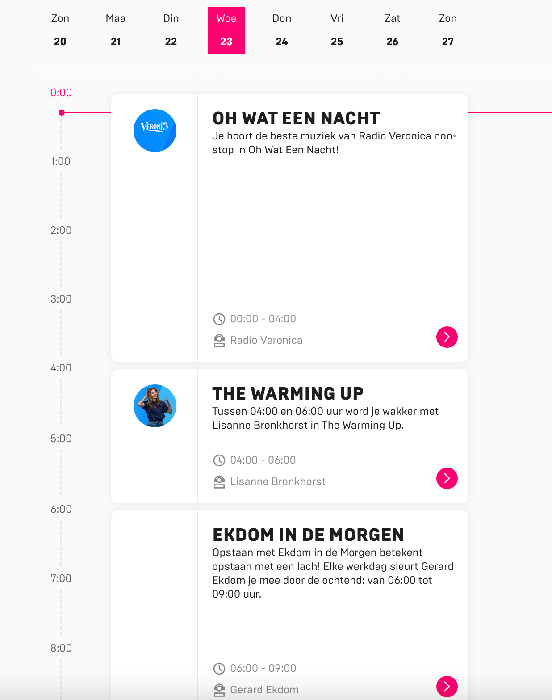

# Accessible Website

Ontwerp en maak voor een opdrachtgever een component/pagina/site toegankelijk volgens WCAG richtlijnen.

De instructie van deze leertaak staat in [INSTRUCTIONS](https://github.com/fdnd-task/all-human-accessible-website/blob/main/docs/INSTRUCTIONS.md)

## Inhoudsopgave

  * [Beschrijving](#beschrijving)
  * [Kenmerken](#kenmerken)
  * [Bronnen](#bronnen)
  * [Licentie](#licentie)

## Beschrijving
<!-- In de Beschrijving staat hoe je project er uit ziet, hoe het werkt en wat je er mee kan. -->
Wat leveren we exact op? 
1. Een interface die niet alleen informatie biedt over progamma's en DJ's, maar ook een gepersonaliseerde ervaring creeert voor elke luisteraar.
2. We hebben de creatieve vrijheid om de interface naar eigen inzicht vorm te geven. 
3. De interface bevat een filterfunctie waarmee consumenten per zender (Veronica, SLAM!, 100%NL, Sublime, Sunglight) kunnen selecteren. Op basis van de gekozen zender krijgen ze een lijst te zien van de progamma's, tijden en DJ's.  

Wat heb ik deze sprint exact gedaan? Ik had vorige sprint de bestaande interface van Veronica exact na gemaakt. Ik had daarna gevraagd voor een code review waar we tot de conclusie waren gekomen dat ik me code helemaal opnieuw moet writen. Deze sprint was ik vooral bezig om mijn code opnieuw te writen volgens de werkwijze die ik ben aangeleerd om zo een goede HTML structuur te hebben met een goede toegankelijkheid, volgens de WCAG richtlijnen. HTML is helemaal goed volgens de WCAG richtlijnen, alleen moet ik nog mijn CSS compleet maken. 

<!-- Voeg een mooie poster visual toe 📸 -->
<!-- Voeg een link toe naar Github Pages 🌐-->
https://poormoa00.github.io/all-human-accessible-website/
## Kenmerken
<!-- Bij Kenmerken staat welke technieken zijn gebruikt en hoe. Wat is de HTML structuur? Wat zijn de belangrijkste dingen in CSS? Wat is er met Javascript gedaan en hoe? Misschien heb je een framwork of library gebruikt? -->
HTML volgens de WCAG richtlijnen en een CSS met goede structuur. 

## Bronnen

## Licentie
This project is licensed under the terms of the [MIT license](./LICENSE).
